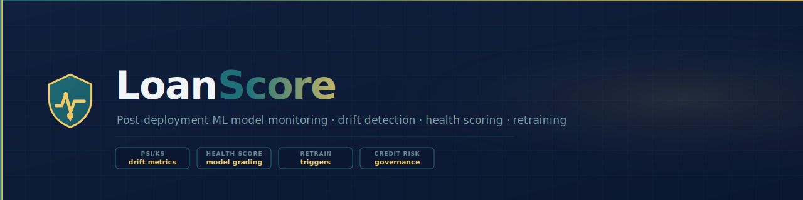
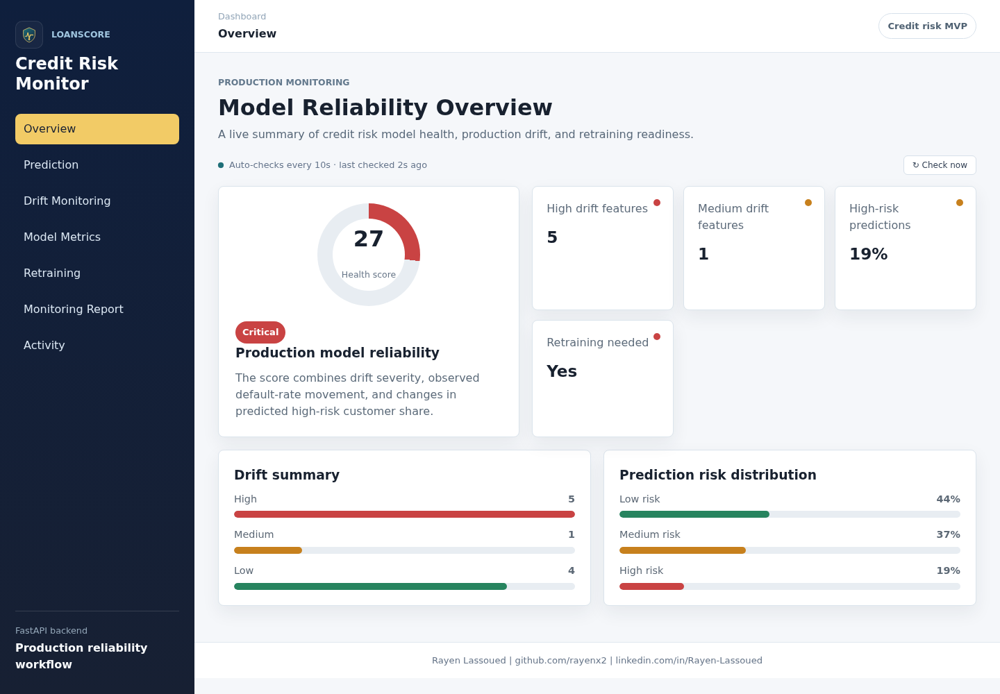
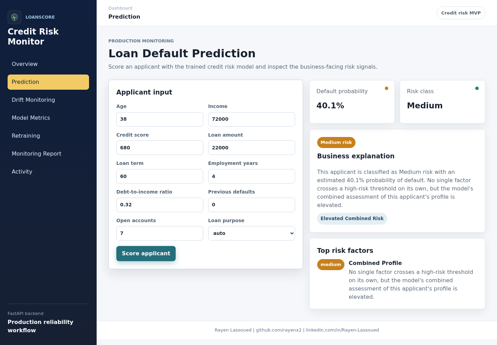
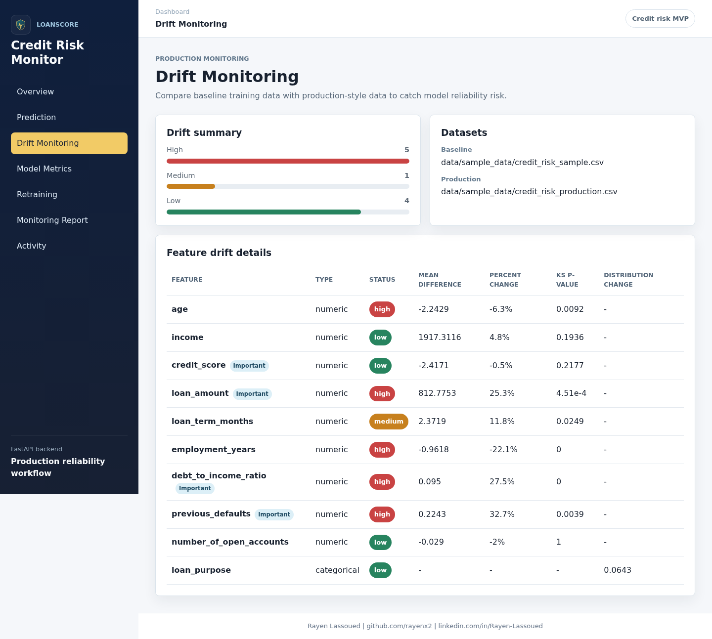
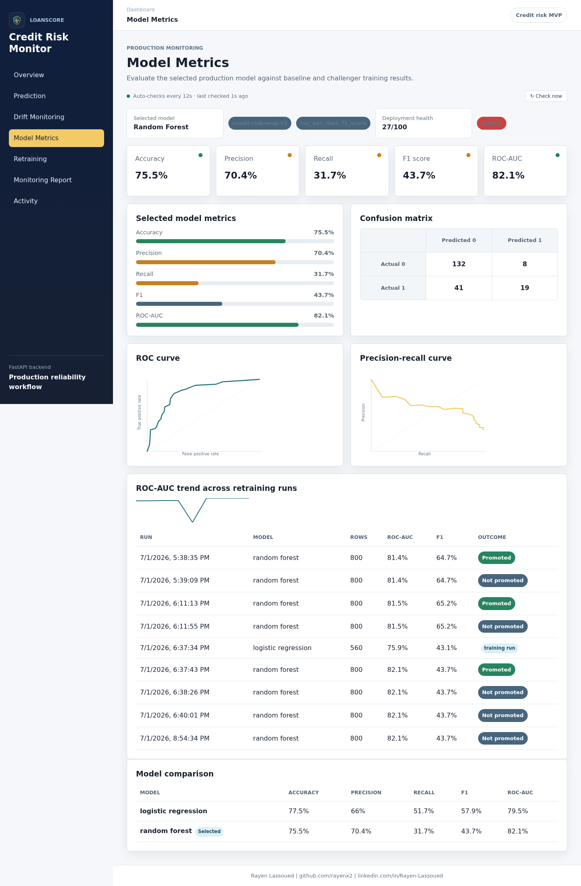
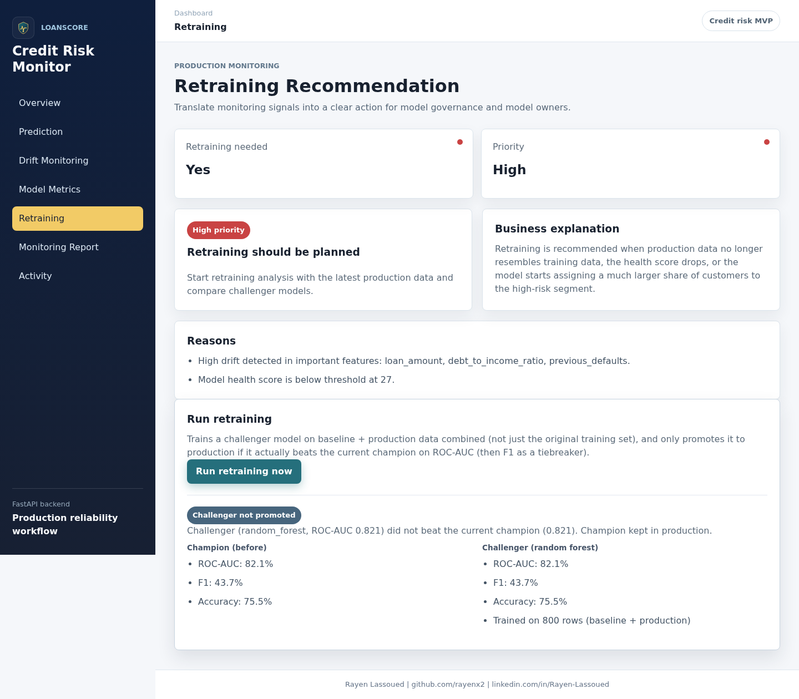
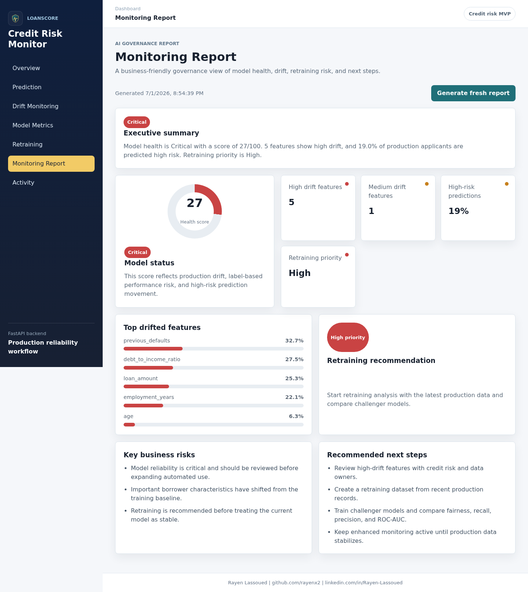
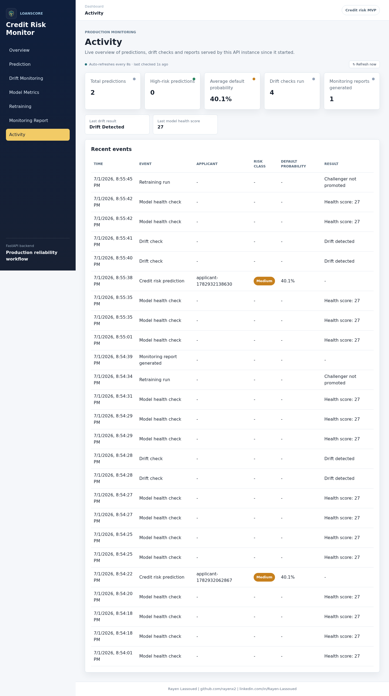

# LoanScore

<p align="center">
  
  
  
  
  
</p>

<p align="center">
  <strong>Post-deployment ML model monitoring — drift detection, health scoring, retraining recommendations</strong><br/>
  Credit-risk model governance · PSI/KS drift metrics · alerting · European lender compliance ready
</p>

<p align="center">
  
</p>


> Post-deployment monitoring for credit-risk ML models — drift detection, model health scoring, and retraining recommendations for European lenders.

## 🚀 Live Demo

Open `demo/index.html` directly in any browser — pure HTML/CSS/JS, no backend required.

## 📸 Screenshots

<table>
<tr>
<td width="50%">

**Overview** — health score, drift summary, risk distribution

</td>
<td width="50%">

**Prediction** — default probability, risk class, explanation

</td>
</tr>
<tr>
<td width="50%">

**Drift Monitoring** — per-feature KS test, mean shift, status

</td>
<td width="50%">

**Model Metrics** — ROC/PR curves, confusion matrix, retrain history

</td>
</tr>
<tr>
<td width="50%">

**Retraining** — champion vs. challenger, priority, reasons

</td>
<td width="50%">

**Monitoring Report** — executive summary for governance review

</td>
</tr>
<tr>
<td width="50%">

**Activity** — live predictions, drift checks, retraining runs

</td>
<td width="50%"></td>
</tr>
</table>

## 📋 Overview

LoanScore is an MLOps monitoring platform built around a credit-risk (loan default)
model. It scores loan applicants, explains *why* the model made each decision, detects
data drift between training and production traffic, calculates a 0-100 model health
score, and recommends when the model should be retrained. Banks, online lenders, and
buy-now-pay-later (BNPL) providers across Germany and the EU are required by financial
regulators (BaFin, EBA model risk guidelines) to continuously monitor credit scoring
models in production — this project demonstrates exactly that workflow end to end.

Trained on real data — the **UCI Statlog German Credit Data** (1,000 real loan
applications) — not a synthetic generator. The production dataset is the same real
data with a disclosed, documented drift simulation applied to 5 feature columns, so
the drift-detection and retraining features have something genuine to catch.

## 🏗️ Architecture

```text
Real credit applicant data (UCI German Credit Data, 1000 rows)
   baseline (700 rows)              production (300 rows + disclosed drift simulation)
            |                                    |
            v                                    v
Feature engineering + preprocessing  (pandas, scikit-learn)
            |
            v
Model training: Logistic Regression  vs  Random Forest
            |   (selected by ROC-AUC then F1; risk thresholds derived from
            |    the winning model's own predicted-probability distribution)
            v
Saved artifacts: model.pkl, preprocessor.pkl, metrics.json, metrics_history.json
            |
            v
FastAPI backend
   ├── /api/v1/predict                       (scoring + explainability)
   ├── /api/v1/drift, /model-health          (drift detection)
   ├── /api/v1/model-metrics (+ /history)    (training metrics, ROC/PR curves, trend)
   ├── /api/v1/retraining-recommendation
   ├── /api/v1/retraining/run                (champion/challenger retraining)
   ├── /api/v1/monitoring-report             (JSON + Markdown report)
   └── /api/v1/activity                      (live usage stats)
            |
            v
React 19 + TypeScript monitoring dashboard
```

## 🛠️ Tech Stack

| Technology | Version | Purpose |
|---|---|---|
| FastAPI | 0.115 | Backend REST API |
| Pydantic | 2.10 | Request/response validation |
| scikit-learn | 1.6 | Logistic Regression + Random Forest models |
| pandas / numpy | 2.x | Feature engineering and drift statistics |
| React | 19 | Monitoring dashboard |
| TypeScript + Vite | 5.x | Frontend build tooling |
| pytest | 8.3 | Backend + ML test suite (25 tests) |
| Docker Compose | - | Local orchestration of backend + frontend |

## ⚡ Quick Start

```bash
git clone git@github.com:rayenx2/LoanScore.git
cd LoanScore
cp .env.example .env
docker compose up -d
```

Then open:
- Backend API docs: http://localhost:8000/docs
- Dashboard: http://localhost:5173

## ✨ Features

- 🎯 Credit risk prediction API with reason codes and per-applicant explainability —
  grounded in the model's actual predicted probability, never independently contradicting it
- 📊 Model metrics dashboard — accuracy, precision, recall, F1, ROC-AUC, confusion matrix,
  real ROC/precision-recall curves, and a trend line across retraining runs
- 🔍 Feature-level drift detection (numeric + categorical, KS test, mean shift)
- 🩺 0-100 model health score with status (Healthy / Warning / Critical)
- 🔁 Champion/challenger retraining — trains on baseline + production data combined and
  only promotes a challenger if it actually beats the deployed model
- 📄 JSON + Markdown monitoring report generation
- 📈 Live activity feed — predictions, drift checks, retraining runs, and reports tracked
  in real time, with auto-refreshing dashboards (10s Overview, 8s Activity, 12s Metrics)
- 🪵 Structured request logging middleware
- ✅ Input validation and clear error responses (404/400/503) across all endpoints
- 🧪 25 passing pytest tests across backend and ML pipeline

## 📊 Results

- Selected model: Random Forest — accuracy **75.5%**, ROC-AUC **82.1%**, F1 **43.7%**
- Trained on 800 rows (baseline + production combined), evaluated on 200 held-out rows
  of real UCI German Credit Data
- Risk-class thresholds (Low/Medium/High) are derived from the model's own predicted-probability
  distribution (median/85th percentile) rather than fixed guesses, so they always track the
  model's real output and stay accurate across retrains
- Drift simulation: **5 of 10** features show high drift in the production dataset
- Resulting model health score: **27/100 (Critical)** — correctly triggers a **High priority**
  retraining recommendation
- Champion/challenger retraining verified live: a challenger trained on baseline+production
  data was promoted after beating the prior champion (ROC-AUC 0.76 → 0.82)

## 🔧 What I Built

- Designed the data layer around real UCI German Credit Data (1,000 real loan applications)
  instead of a synthetic generator — mapped and documented every field, deriving
  `credit_score`/`income` via a disclosed scorecard-style formula for the two attributes
  the real dataset doesn't natively include
- Implemented probability calibration deliberately: trained without class-weight correction
  so `predict_proba` output tracks the real ~30% base default rate, then derived risk-class
  thresholds (Low/Medium/High) directly from the trained model's own probability distribution
  instead of hand-picked cutoffs
- Built the explainability layer around continuous, per-feature risk scores rather than
  independent boolean thresholds, so the reason codes and risk factors shown to the user are
  always mathematically consistent with the model's own predicted risk class
- Built a champion/challenger retraining pipeline (`/api/v1/retraining/run`): trains a
  challenger on baseline + production data combined, only promotes it if it beats the
  deployed model on ROC-AUC/F1, and records a full audit trail to `metrics_history.json`
- Added real ROC/precision-recall curves and a metrics-history trend chart to the dashboard
- Implemented live auto-refreshing dashboards (10s Overview, 8s Activity, 12s Metrics) with
  visible "last checked" timers and new-row highlight animations
- Designed the Prediction form without an "Applicant ID" field — this is a stateless scoring
  tool with no applicant database, so an internal ID is generated automatically instead of
  asking the user for one that implies a lookup that doesn't exist
- Volume-mounted `ml/artifacts` in Docker Compose and standardized training to run inside
  the container, keeping the served model and its scikit-learn version always in sync
- Built `/api/v1/activity` — an in-memory tracking service and live feed for predictions,
  drift checks, model health checks, retraining runs, and report generations
- Added structured request logging middleware (method/path/status/duration)
- Designed the UI identity (shield/vault monogram, navy/teal/gold theme, LoanScore branding)
- Verified the full stack end-to-end — every page, every button — via Docker + headless
  browser testing, zero console errors

## 🎯 European Market Use Cases

- **Online lenders / BNPL providers** (e.g., Klarna-style products) need continuous
  monitoring of credit scoring models as customer demographics shift
- **German Sparkassen and Volksbanken** must demonstrate ongoing model risk
  management to BaFin under MaRisk and EBA guidelines on loan origination
- **Fintech credit scoring startups** can use this as a lightweight monitoring
  layer before investing in a full MLOps platform (e.g., Evidently, Arize)
- **Risk and compliance teams** get a business-readable monitoring report without
  needing to read raw model logs or notebooks

## 👤 Author

**Rayen Lassoued**
[github.com/rayenx2](https://github.com/rayenx2) | [LinkedIn](https://linkedin.com/in/Rayen-Lassoued)

## 📄 License

MIT
